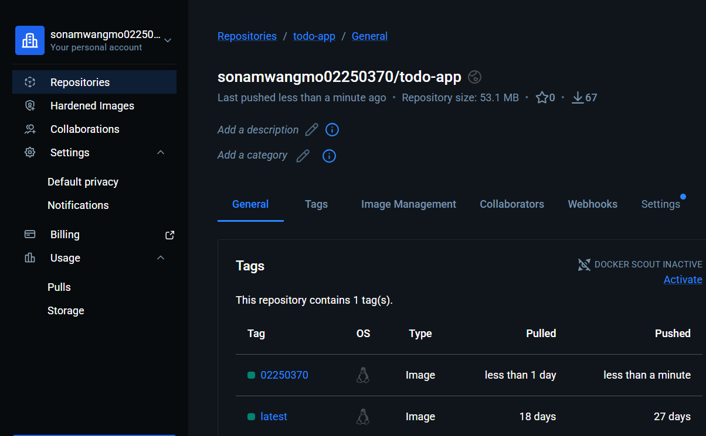
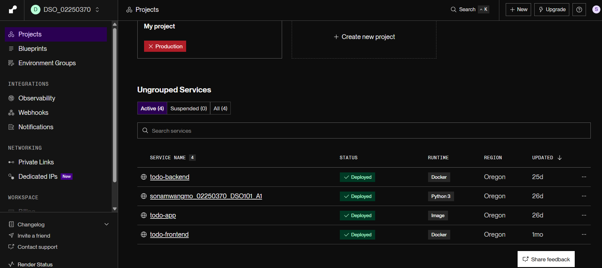
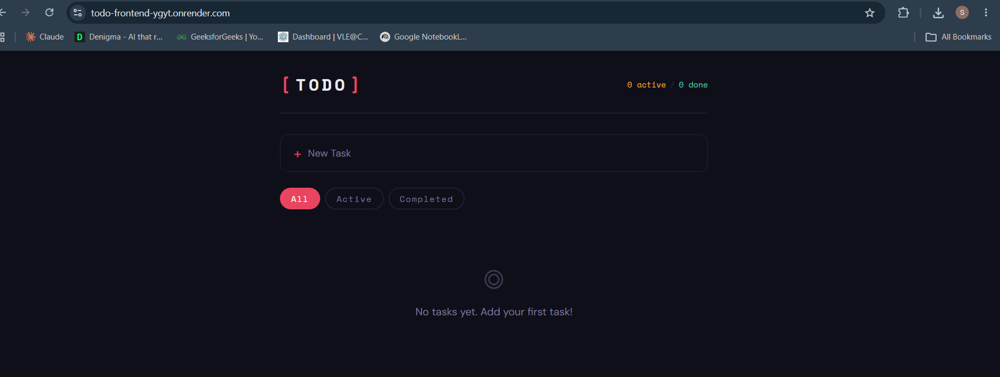
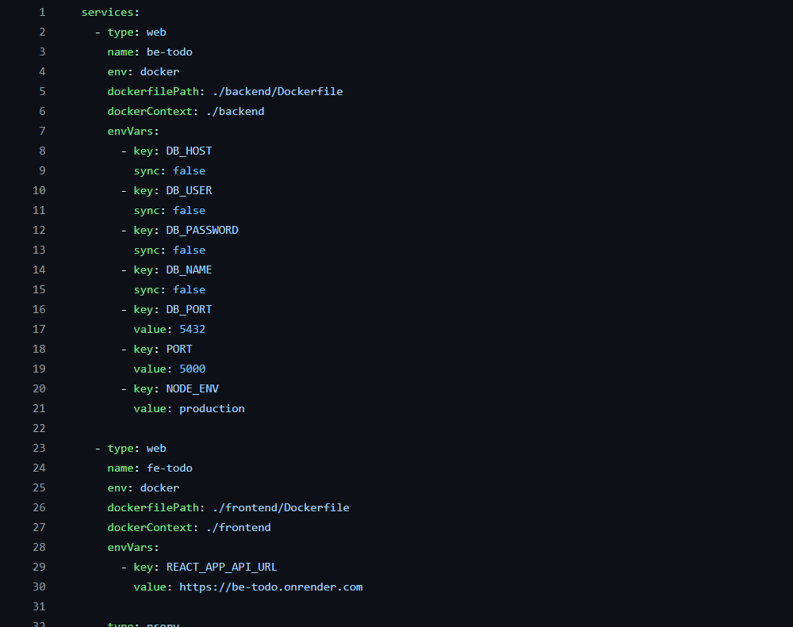

Assignment 1 – Deploying a To-Do List Application using Docker & Render.com
Course: Continuous Integration and Continuous Deployment (DSO101)  
Program: Bachelor of Engineering in Software Engineering (SWE)  
Submission Date: 12th March
---
Table of Contents
Overview
Tools & Technologies
Steps Taken
Screenshots
Challenges Faced
Learning Outcomes
Live Deployment Links
---
Overview
This assignment involved building a full-stack To-Do List web application with a Frontend (UI), Backend (CRUD API), and Database (PostgreSQL). The application was containerized using Docker and deployed on Render.com in two ways:
Part A: Manual deployment using pre-built Docker images from DockerHub
Part B: Automated deployment directly from a GitHub repository using a `render.yaml` blueprint
---
Tools & Technologies
Tool	Purpose
Node.js / React	Backend and Frontend runtime
PostgreSQL	Database
Docker	Containerization
DockerHub	Container image registry
Render.com	Cloud deployment platform
GitHub	Source code hosting
.env	Environment variable management
---
Steps Taken
Step 0: Building the Application
Created a full-stack To-Do List app with:
Frontend: React UI for adding, editing, and deleting tasks
Backend: Node.js Express CRUD API
Database: PostgreSQL for persistent storage
Configured `.env` files for both frontend and backend:
Backend `.env`: `DB_HOST`, `DB_USER`, `DB_PASSWORD`, `PORT=5000`
Frontend `.env`: `REACT_APP_API_URL=http://localhost:5000`
Added `.env` to `.gitignore` to avoid committing credentials.
Tested the application locally to ensure it worked correctly.
---
Part A: Deploying Pre-Built Docker Images to DockerHub
1. Writing Dockerfiles
Created separate Dockerfiles for the backend and frontend services.
Backend Dockerfile:
```dockerfile
FROM node:18-alpine
WORKDIR /app
COPY package*.json ./
RUN npm install
COPY . .
EXPOSE 5000
CMD ["node", "server.js"]
```
2. Building and Pushing Images to DockerHub
Ran the following commands using my student ID as the image tag:
```bash
# Backend
docker build -t <dockerhub-username>/be-todo:<student-id> ./backend
docker push <dockerhub-username>/be-todo:<student-id>

# Frontend
docker build -t <dockerhub-username>/fe-todo:<student-id> ./frontend
docker push <dockerhub-username>/fe-todo:<student-id>
```
3. Deploying on Render.com
Created a Web Service on Render.com for the backend, selected "Existing image from DockerHub"
Set environment variables on Render: `DB_HOST`, `DB_USER`, `DB_PASSWORD`, `PORT`
Created a Web Service for the frontend, selected the frontend Docker image
Set `REACT_APP_API_URL` to the live backend URL from Render
Created a PostgreSQL database on Render and connected it to the backend
---
Part B: Automated Deployment from GitHub
1. Repository Structure
```
/todo-app
  /frontend
    Dockerfile
    .env.production
  /backend
    Dockerfile
    .env.production
  render.yaml
```
2. Configuring render.yaml
Created a `render.yaml` blueprint file to define multi-service deployment:
```yaml
services:
  - type: web
    name: be-todo
    env: docker
    dockerfilePath: ./backend/Dockerfile
    envVars:
      - key: DB_HOST
        value: your-render-db-host
      - key: PORT
        value: 5000

  - type: web
    name: fe-todo
    env: docker
    dockerfilePath: ./frontend/Dockerfile
    envVars:
      - key: REACT_APP_API_URL
        value: https://be-todo.onrender.com
```
3. Connecting GitHub to Render
Connected the GitHub repository to Render.com
Enabled automatic redeploy on every new git push to the `main` branch
---
Screenshots
Part A Screenshots
1. DockerHub – Backend and Frontend Image Pushed

2. Render.com – Backend and Frontend Services Running

3. Live Application

---
Part B Screenshots
4. render.yaml File in Repository

5. Render Auto-Deploy Triggered

---
Challenges Faced
Environment Variables: Initially forgot to add `.env` to `.gitignore`, which could have exposed credentials. Fixed by adding it immediately.
CORS Errors: The frontend was unable to communicate with the backend due to CORS. Resolved by adding the `cors` middleware to the Express backend.
Database Connection: Connecting the PostgreSQL database on Render required using the internal connection string, not the external one, for better performance.
Docker Build Failures: Missing `package-lock.json` caused the `npm install` step to fail. Fixed by ensuring both `package.json` and `package-lock.json` were copied before running install.
---
Learning Outcomes
Gained hands-on experience building and containerizing a full-stack web application using Docker.
Learned how to push Docker images to DockerHub and use them for cloud deployment.
Understood the difference between manual deployment (Part A) and automated Git-based deployment (Part B).
Learned how to manage sensitive credentials safely using environment variables and `.gitignore`.
Understood how `render.yaml` works as a blueprint for orchestrating multi-service deployments, similar to `docker-compose.yml`.
---
Live Deployment Links   Service	URL
Frontend	             https://todo-frontend-ygyt.onrender.com
Backend API	             https://todo-backend-eoqy.onrender.com


Assignment 2 – Jenkins CI/CD Pipeline
Course: Continuous Integration and Continuous Deployment (DSO101)  
Program: Bachelor of Engineering in Software Engineering (SWE)  
Submission Date: 25th March
---
Table of Contents
Overview
Tools & Technologies
Steps Taken
Screenshots
Challenges Faced
Learning Outcomes
---
Overview
I set up a Jenkins pipeline to automatically build, test, and deploy the To-Do app from Assignment 1. The pipeline automates the following stages:
Code checkout from GitHub
Dependency installation
Build step
Unit testing using Jest
Docker image build and push to DockerHub
---
Tools & Technologies
Tool	Purpose
Jenkins	CI/CD automation
GitHub	Source code hosting
Node.js & npm	JavaScript runtime and package management
Jest	Unit testing framework
Docker	Containerization
DockerHub	Container image registry
---
Steps Taken
Step 1: Installed Jenkins
Downloaded Jenkins from jenkins.io
Ran it on localhost:8080
Completed the setup wizard
Step 2: Installed Plugins
Went to Manage Jenkins > Plugins and installed:
NodeJS Plugin
Pipeline
GitHub Integration
Docker Pipeline
Step 3: Configured Node.js in Jenkins
Went to Manage Jenkins > Tools > NodeJS
Added Node.js LTS v20.x
Step 4: Connected GitHub to Jenkins
Created a Personal Access Token (PAT) on GitHub
Added it as credentials in Jenkins under Manage Jenkins > Credentials
Step 5: Created the Jenkinsfile
Added a `Jenkinsfile` to the root of the repo:
```groovy
pipeline {
    agent any
    tools {
        nodejs 'NodeJS'
    }
    stages {
        stage('Checkout') {
            steps {
                git branch: 'main',
                    url: 'https://github.com/sonamwangmo9/sonamwangmo_02250370_DSO101_A1.git'
            }
        }
        stage('Install') {
            steps {
                sh 'npm install'
            }
        }
        stage('Build') {
            steps {
                sh 'npm run build'
            }
        }
        stage('Test') {
            steps {
                sh 'npm test'
            }
            post {
                always {
                    junit 'junit.xml'
                }
            }
        }
        stage('Deploy') {
            steps {
                script {
                    docker.build('sonamwangmo02250370/todo-app:latest')
                    docker.withRegistry('https://registry.hub.docker.com', 'docker-hub-creds') {
                        docker.image('sonamwangmo02250370/todo-app:latest').push()
                    }
                }
            }
        }
    }
}
```
Step 6: Configured Jest for JUnit Reports
Installed jest-junit:
```
npm install --save-dev jest jest-junit
```
Updated `package.json`:
```json
{
  "scripts": {
    "test": "jest --ci --reporters=default --reporters=jest-junit",
    "build": "node server.js"
  }
}
```
Step 7: Ran the Pipeline
Created a new Pipeline job in Jenkins
Set Pipeline Definition to Pipeline script from SCM
Set SCM to Git and added the GitHub repo URL
Added GitHub credentials
Clicked Build Now
---
Challenges Faced
NodeJS Plugin: Jenkins could not find npm at first. Fixed by properly setting up NodeJS under Manage Jenkins > Tools.
GitHub Authentication: Pipeline failed to clone the repo. Fixed by adding GitHub PAT as credentials in Jenkins.
JUnit Reports: junit.xml not found error. Fixed by installing jest-junit and updating the test script in package.json.
Docker Permissions: Jenkins could not run Docker commands. Fixed by adding Jenkins user to the Docker group.
---
Learning Outcomes
Learned how to install and configure Jenkins for a Node.js project.
Learned how to write a multi-stage Jenkinsfile.
Learned how to connect Jenkins to GitHub using a Personal Access Token.
Learned how to generate JUnit test reports using jest-junit.
Understood how CI/CD pipelines catch errors automatically.

Assignment 3 – CI/CD with GitHub Actions
Course: Continuous Integration and Continuous Deployment (DSO101)  
Program: Bachelor of Engineering in Software Engineering (SWE)  
Student ID: 02250370  
Name: Sonam Wangmo
---
What I Did
In this assignment I set up a CI/CD pipeline using GitHub Actions for the same To-Do List application from Assignment 1. When I push code to the main branch, GitHub Actions automatically builds a Docker image, pushes it to DockerHub, and deploys it to Render.com.
---
Tools Used
GitHub Actions
Docker and DockerHub
Render.com
Node.js and React
PostgreSQL
---
Repository
GitHub Repo: https://github.com/sonamwangmo9/todo-app
---
Live Deployment
Service	URL
Frontend	https://todo-frontend-ygyt.onrender.com
Backend API	https://todo-backend-eoqy.onrender.com
---
Steps I Followed
1. Created a Public GitHub Repository
Pushed the To-Do app code to a public GitHub repository including the Dockerfile and workflow file.
2. Added GitHub Secrets
Added these three secrets under Settings → Secrets and Variables → Actions:
Secret Name	What It Is
DOCKERHUB_USERNAME	My DockerHub username
DOCKERHUB_TOKEN	My DockerHub access token
RENDER_DEPLOY_HOOK_URL	The deploy hook URL from Render
3. Created the GitHub Actions Workflow
Created the file `.github/workflows/deploy.yml` with these stages:
```yaml
name: CI/CD Pipeline

on:
  push:
    branches:
      - main

jobs:
  build-and-deploy:
    runs-on: ubuntu-latest

    steps:
      - name: Checkout Code
        uses: actions/checkout@v3

      - name: Log in to DockerHub
        uses: docker/login-action@v3
        with:
          username: ${{ secrets.DOCKERHUB_USERNAME }}
          password: ${{ secrets.DOCKERHUB_TOKEN }}

      - name: Build and Push Docker Image
        uses: docker/build-push-action@v5
        with:
          push: true
          tags: ${{ secrets.DOCKERHUB_USERNAME }}/todo-app:latest

      - name: Trigger Render Deployment
        run: curl ${{ secrets.RENDER_DEPLOY_HOOK_URL }}
```
4. Pushed Code to Trigger the Pipeline
Pushed code to the main branch which automatically triggered the workflow.
5. Verified Deployment
Checked DockerHub for the new image and confirmed the app was live on Render.
---

---
Challenges I Faced
Setting up the correct Docker build context in the workflow file
Getting the Render deploy hook URL from the dashboard
Making sure all three GitHub secrets were correctly named
---
What I Learned
How to write a GitHub Actions workflow file
How to use secrets to store sensitive information securely
How to automatically build and push Docker images using Actions
How to trigger Render deployments using a webhook URL